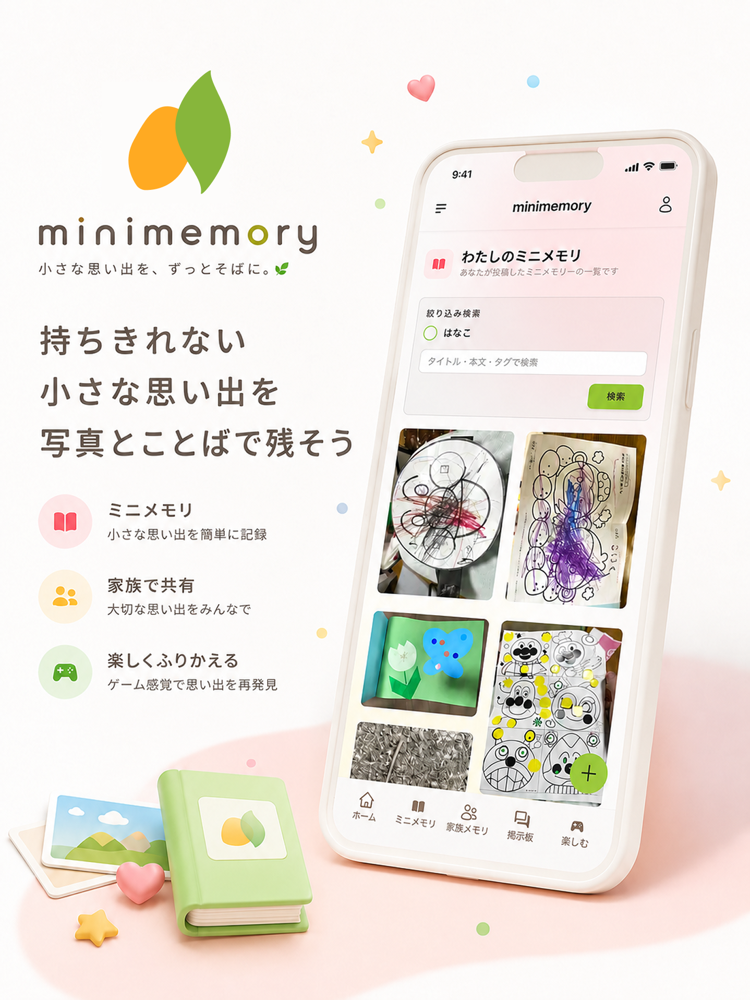
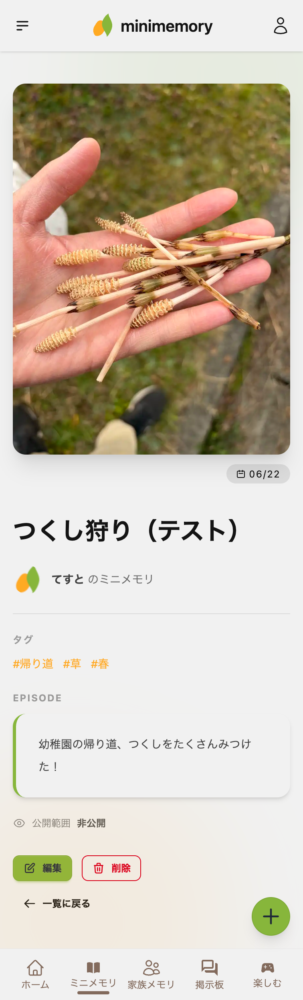
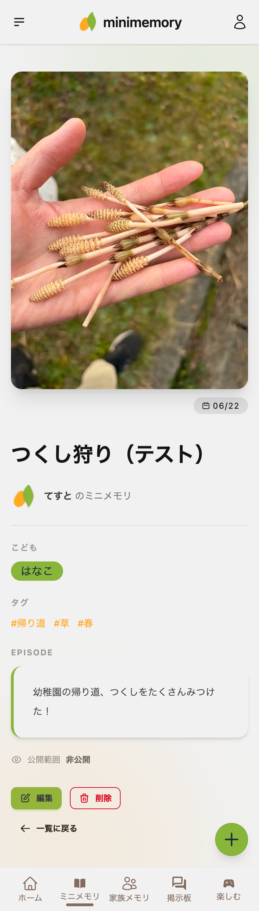
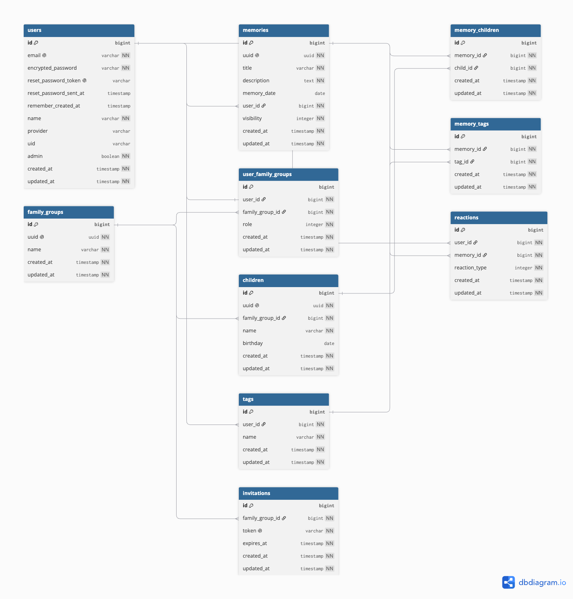

# ミニメモリー

## 目次
- [サービス概要](#サービス概要)
- [サービスURL](#サービスurl)
- [サービス開発の背景](#サービス開発の背景)
- [ターゲット層](#ターゲット層)
- [ターゲット層の理由](#ターゲット層の理由)
- [ユーザー獲得方法](#ユーザー獲得方法)
- [機能紹介](#機能紹介)
- [技術スタック](#技術スタック)
- [技術選定の理由](#技術選定の理由)
- [画面遷移図](#画面遷移図)
- [ER図](#er図)

## 🌱サービス概要
〜持ちきれない小さな思い出を写真とことばで残そう〜

子育て中に増えていく「捨てられないけれど保管しきれない小さな思い出の品」を、写真とエピソードで記録するアプリです。

どんぐり、葉っぱ、折り紙、らくがき。子どもの成長とともに増えていく、手放しにくい小さな宝物たちを、そのときのエピソードと一緒にデジタルで残せます。

罪悪感なくモノの整理をしながら、大切な思い出はちゃんとここに残しましょう。

## 🌍サービスURL
https://minimemory.jp/

## 📝サービス開発の背景

普段子どもを育てていると、子どもが拾ってきたどんぐりやずっと握りしめていた葉っぱ、子どもの気の向くままに書いた落書き、折り紙や小さなおもちゃなど「取っておくほどではないけれど捨てられない」モノが日々増えていきます。

しかし、取っておいたとしても後から見返したとき「どうしてこれを取っておいたのか」「その時の子どもの様子や感情」を忘れてしまうことが多くありました。せっかく「取っておきたい」と思った瞬間の気持ちが思い出せないまま、結局捨ててしまうことが何度もありました。

取っておくほどではないけれど捨てられない理由は、

- 子どもにとっては宝物であるから
- そのモノにはその時感じた子どもの小さな思い出があるから
- 捨ててしまったら子どもに申し訳ない気持ちがあるから

そんな「捨てる罪悪感」を軽減し、モノの整理と同時に子どもとそのモノにまつわる思い出の記録を両立させたいと思い、このアプリを作りました。

## 🎯ターゲット層

- モノにまつわる子どもの思い出を全て残したいけど、物理的に保管しきれない方
- モノにまつわる小さな思い出をあとから振り返りたい方
- 「捨てたいけど捨てられない」罪悪感に悩んでいる子育て中の保護者

## 🎯ターゲット層の理由

子育て世帯では、子どもから渡される小さなモノや作品が日々増え続け、住居スペースを圧迫します。

一方で、片付けや断捨離を主軸にしたサービスは「捨てる」ことが目的になっており、モノの思い出ごと記録するという発想がありません。子ども写真アルバムも、子ども自身にフォーカスしているため、モノを起点に思い出を残す手段が欠けています。

「写真と一緒にそのモノの背景まで残せる」というニーズに応えるサービスは、現状ほとんど存在しません。

## 📈ユーザー獲得方法

- 子育て中の保護者を中心としたコミュニティ（X、ブログ、子育てメディア）で発信します。
- 公開された思い出を登録不要で閲覧できる「掲示板」の投稿を OGP 対応にし、SNS でのシェア拡散からの流入を狙います。
- LINE や Google ログインに対応することで、子育て世代の登録ハードルを下げます。

## 機能紹介
### 👤ユーザー機能
| 新規登録 / ログイン | 名前 / アカウント画像変更 |
|:--:|:--:|
|  |  |

メールアドレスとパスワードで新規登録ができます。
登録後は自動でログイン処理が行われ、すぐにサービスを利用することができます。LINE または Google ログインも可能です。 
登録後、いつでも名前とアカウント画像を変更できます。

### 🍃捨てられないモノの思い出記録機能
| 思い出の作成 | 思い出の詳細 |
|:--:|:--:|
|  |  |

写真・タイトル・エピソード・日付を 1 件の思い出として記録できます。公開範囲を「非公開 / 家族グループ公開 / 全体公開」から選べます。画像は webp 形式に変換して Active Storage + Cloudinaryに保存しており、画質を保ちながらデータ容量を抑えています。 詳細画面の URL には UUID を使用し、連番 ID が外部に漏れない設計にしています。

#### 🖼️思い出を見るための 3 つの一覧機能
| ミニメモリ | 家族メモリ | 掲示板 |
|:--:|:--:|:--:|
|  |  |  |
##### ミニメモリ
自分が投稿した思い出を、公開範囲を問わずすべて閲覧できます。
##### 家族メモリ
同じ家族グループに所属するメンバーが投稿した思い出のうち、家族グループ公開・全体公開のものを閲覧できます。
##### 掲示板
全体公開に設定された思い出を、ログインしていなくても閲覧できます。

### 🧑‍🧑‍🧒家族グループ作成機能
| 家族グループの作成 | メンバー招待 |
|:--:|:--:|
|  |  |

ユーザーは家族グループを作成可能です（1 ユーザー 1 家族グループ制）。 招待リンクを発行して、家族メンバーを招待できます。

| 家族グループに参加 | ロール変更・自己脱退・強制退会 |
|:--:|:--:|
|  |  |

招待リンクを開くと、対象の家族グループに参加するかどうかを選択できます。 オーナー権限を持つメンバーは、他メンバーのロール変更（オーナー / メンバー）と強制退会を行えます。自己脱退はすべてのメンバーが行えますが、最後のオーナーは脱退できません。

### 👧家族グループに紐づく子ども設定機能
| 子ども作成 | 思い出への紐付け |
|:--:|:--:|
|  |  |

家族グループに紐づく「子ども」を登録できます。 思い出の作成または編集時に子どもと紐付けて記録できます。

### 🎮楽しく思い出を振り返るゲーム機能
| おもいでカードあわせ（神経衰弱） | クリア画面 |
|:--:|:--:|
||  |

記録した思い出をカードあわせにして遊ぶことができます。お子さんと一緒に遊びながら、楽しく思い出を振り返ることができます。 すべてのペアを揃えると紙吹雪が舞い、達成感を味わえる演出にしています。

### 🔍その他機能
| リアクション機能 |
|:--:|
|  |

掲示板に投稿された他ユーザーの思い出に対して、5 種類のリアクションを送ることができます。

| X共有機能 |
| :--:|
|  |

自分の思い出はもちろん、他のユーザーの思い出も気に入ったものを X (旧 Twitter) で共有できます。

| 検索機能 |
| :--:|
|  |

子ども別、またはキーワードで思い出を検索できます。

## 🔧技術スタック

| カテゴリ | 技術 |
| --- | --- |
| 言語 / FW | Ruby 3.3.6 / Ruby on Rails 8.1.3 |
| 認証 | Devise / omniauth-line（LINE ログイン） |
| 認可 | Pundit |
| フロント | Hotwire (Turbo + Stimulus) / React 19（神経衰弱のみ） |
| JS / CSS ビルド | esbuild (jsbundling-rails) / Tailwind 4 + daisyUI |
| DB | PostgreSQL 17（本番: Neon） |
| 画像保存 | Active Storage + Cloudinary（webp 保存） |
| 国際化 | rails-i18n + devise-i18n |
| テスト | RSpec |
| 開発環境 | Docker |
| CI/CD | GitHub Actions（Brakeman / RuboCop / RSpec / SimpleCov ） |
| ホスティング | Render |

### ✅技術選定の理由

  #### 言語 / FW: Ruby / Ruby on Rails
  Rails の「設定より規約」という原則により、アプリケーションの細かな設定を大幅に減らし、開発時間を短縮できると考え採用しました。Web アプリケーションに必要な標準機能が一通り揃っており、個人開発でも迅速にアプリケーションを構築できる点も理由のひとつです。

  #### 認証: Devise + OmniAuth
  Devise は Rails での認証機能を短期間で実装でき、実装・運用実績が豊富で、複数のモジュールを通じて機能拡張がしやすいという点から採用しました。ターゲットである子育て世代に浸透している LINE と Google の外部認証との連携がOmniAuth 経由で容易に行える点も理由の一つです。

  #### 認可: Pundit
  権限判定ロジックをコントローラーやモデルから Policy に分離して管理できるため、コードの可読性と保守性の向上につながると考え採用しました。家族グループ単位の公開範囲制御という、本サービス固有の認可要件にもフィットしています。

  #### DB: PostgreSQL（本番環境: Neon）
  信頼性が高く、Rails との相性も良いため採用しました。本番環境ではサーバーレス型 PostgreSQL サービスである Neon を採用し、必要に応じてスケール可能な構成にすることで、インフラ管理コストを抑えています。

  #### フロント: Hotwire (Turbo + Stimulus) / 一部 React
  Hotwire でサーバーサイドレンダリングを基本にし、フォーム再描画やリアクション更新は Turbo Stream で部分更新する方式により、SPA 風のユーザー体験を実現しました。SPA を採用する場合と比較し、コストを抑えつつ開発効率と保守性を両立できる点も採用理由の一つです。一方で、神経衰弱ゲームのように状態管理が複雑な機能は Hotwire のみでは実装が複雑化する可能性があったため、React を部分的に採用し、コンポーネントベースでの状態管理を行う構成にしました。

  #### CSS: Tailwind CSS + daisyUI
  Tailwind のユーティリティクラスと daisyUI のコンポーネントを組み合わせることで、ボタンやフォームなどの UI を効率的に実装でき、デザインの統一性を保ちながら開発速度を向上できる点から採用しました。

  #### 画像保存: Active Storage（本番環境: Cloudinary）
  Active Storage を用いることで Rails 標準の仕組みに沿ってファイルを管理できます。本番環境では Cloudinary と組み合わせ、画像処理時に webp に変換することで、写真メインのサービスでも転送量を抑えつつ表示速度を向上できる構成にしました。

  #### ホスティングサービス: Render
  Rails アプリのデプロイが容易で、開発当初は無料枠を活用しコストを抑えた運用が可能であったため採用しました。

  #### 開発環境: Docker
  本番環境との整合性を保ち、環境構築を容易にするため採用しました。

  #### CI/CD: GitHub Actions
  Render へのデプロイ自動化に加えて、Brakeman（セキュリティ静的解析）/ RuboCop（スタイル）/ RSpec + SimpleCov（テスト・カバレッジ）を CI 上で走らせ、品質ゲートをワークフローに統一しました。

## 画面遷移図

https://www.figma.com/design/Bkcr6pD16cOWottqsE4RwW/%E3%83%9F%E3%83%8B%E3%83%A1%E3%83%A2%E3%83%AA%E3%83%BC%E7%94%BB%E9%9D%A2%E9%81%B7%E7%A7%BB%E5%9B%B3?node-id=0-1&t=nNqf2re7BqmkHzf6-1

## ER図

