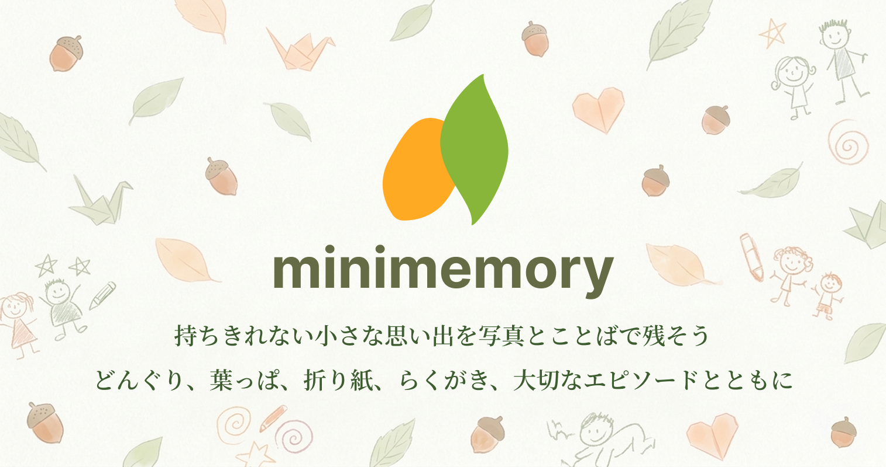

# ミニメモリー

〜こどもの小さな宝物を、思い出ごと残す〜

https://minimemory.jp/

## ■サービス概要

子育て中に増えていく「捨てられないけど保管しきれない小さな思い出の品」を、写真とエピソードで記録するアプリです。

どんぐり、葉っぱ、折り紙、らくがき。子どもの成長とともに増えていく、手放しにくい小さな宝物たちを、そのときの子どもの様子と一緒にデジタルで残せます。

罪悪感なくモノの整理をしながら、大切な思い出はちゃんとここに。

## ■開発背景

普段子どもを育てていると、子どもが拾ってきたどんぐりやずっと握りしめていた葉っぱ、子どもの気の向くままに書いた落書き、折り紙や小さなおもちゃなど「取っておくほどではないけど捨てられない」モノが日々増えていきます。

しかし取っておいたとしても後々見返した時、どうしてこれを取っておいたのか、その時の子どもの様子や感情など忘れてしまうことが多く、折角その時は「取っておきたい」思い出だったのにも関わらず、その思い出を思い出せないまま捨ててしまうことが多々ありました。

取っておくほどではないけど捨てられない理由は、

- 子どもにとっては宝物であるから
- そのモノにはその時感じた子どもの小さな思い出があるから
- 捨ててしまったら子どもに申し訳ない気持ちがあるから

そんな「捨てる罪悪感」を軽減し、モノの整理と同時に子どもとそのモノにまつわる思い出の記録を両立させたいと思い、このアプリを作りました。

## ■ターゲット層

- モノにまつわる子どもの思い出を全て残したいけど、物理的に保管しきれない方
- モノにまつわる小さな思い出をあとから振り返りたい方
- 「捨てたいけど捨てられない」罪悪感に悩んでいる子育て中の保護者

## ■ターゲット層の理由

子育て世帯では、子どもが拾ってくる小さなモノや作品が日々増え続け、住居スペースを圧迫します。

一方で、片付けや断捨離を主軸にしたサービスは「捨てる」ことが目的になっており、思い出ごと記録するという発想がありません。子ども写真アルバムも、子ども自身の写真にフォーカスしているため、「モノ」を起点に思い出を残す手段が欠けています。

「写真と一緒にそのモノの背景まで残せる」というニーズに応えるサービスは、現状ほとんど存在しません。

## ■ユーザー獲得方法

- 子育て中の保護者を中心としたコミュニティ（X、ブログ、子育てメディア）で発信
- 公開された思い出を登録不要で閲覧できる「みんなの思い出」を OGP 対応にし、SNS でのシェア拡散からの流入を狙う
- LINE ログインに対応することで、子育て世代の登録ハードルを下げる

## ■主要な機能

### 思い出の記録

- 写真・タイトル・エピソード・どの子の思い出か・日付を記録
- 公開範囲を設定（非公開／家族のみ公開／公開）
- 画像は webp で保存（Active Storage + Cloudinary）
- UUID ベースの URL で連番 ID を外部に露出しない

-------

### ユーザー機能

- メール認証によるユーザー登録・ログイン（Devise）
- LINE または Googleログインも可能

-------

### 家族グループ

- 家族グループの作成・参加・退出
- グループメンバー間で思い出を共有
- 1 ユーザー 1 家族グループ制（uniqueness 制約あり）

-------

### みんなの思い出（公開する思い出）

- 全ユーザーに向けて思い出を公開
- ユーザー登録なしでも閲覧可能
- OGP 対応で SNS シェアからの流入に対応
- 他人の投稿に対するリアクション機能

-------

### 神経衰弱ゲーム

- 残した思い出を神経衰弱ゲームで振り返り
- React で実装
- お子さんと一緒に遊びながら、自然と思い出話のきっかけに

## ■技術スタック

| カテゴリ | 技術 |
| --- | --- |
| 言語 / FW | Ruby 3.3.6 / Ruby on Rails 7.2.2 |
| 認証 | Devise / omniauth-line（LINE ログイン） |
| 認可 | Pundit |
| フロント | Hotwire (Turbo + Stimulus) / React 19（神経衰弱のみ） |
| JS / CSS ビルド | esbuild (jsbundling-rails) / Tailwind 4 + daisyUI |
| DB | PostgreSQL 17（本番: Neon） |
| 画像保存 | Active Storage + Cloudinary（webp 保存） |
| 国際化 | rails-i18n + devise-i18n |
| テスト | RSpec / Capybara + Selenium（headless Chrome） |
| コンテナ | Docker (compose.yml + Dockerfile.dev) |
| CI/CD | GitHub Actions（Brakeman / RuboCop / RSpec / SimpleCov 90%+） |
| 環境変数 | dotenv-rails |
| ホスティング | Render |

## ■画面遷移図

https://www.figma.com/design/Bkcr6pD16cOWottqsE4RwW/%E3%83%9F%E3%83%8B%E3%83%A1%E3%83%A2%E3%83%AA%E3%83%BC%E7%94%BB%E9%9D%A2%E9%81%B7%E7%A7%BB%E5%9B%B3?node-id=0-1&t=nNqf2re7BqmkHzf6-1

## ■ER図

